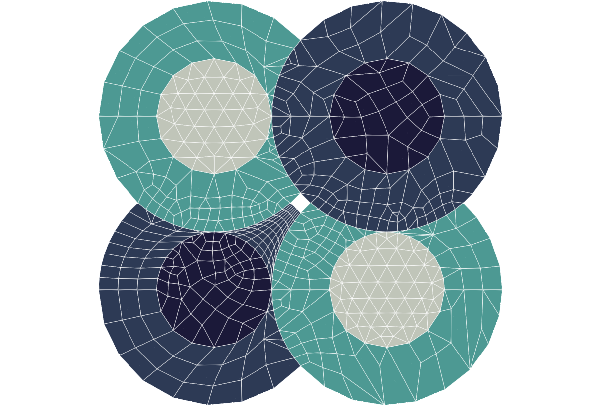

# Quick Start Guide


## Introduction
*Promesh* is a modular, extensible
resource designed for use in typical application development systems as well as
distributed web-services environments. The project focus is providing a
framework for robust, automated mesh generation, mesh quality analysis, adaptive
mesh refinement, and data transfer between arbitrary meshes. Python bindings to
the *Promesh* library can also be enabled.

## Installation

>**Note:** These installation guides have been tested for Ubuntu 18.04 and CentOS 7 systems.

### Prerequisites

Before *Promesh* can be installed, there are some dependencies and third 
party libraries (TPLs) that must be acquired and installed. Some of these can be
obtained on Unix machines via `apt install`:

**Ubuntu:**

Start with:
```commandline
apt update --fix-missing
```

* **build-essential** - GCC compiler. Alternatively, your favorite compiler.
* **cmake** - Alternatively, latest version also available from [Kitware](https://cmake.org/download/)
* **doxygen** - Documentation requirement
* **graphviz** - Documentation requirement
* **libgl1-mesa-dev** - *VTK* requirement
* **libxt-dev** - *VTK* requirement
* **zlib1g-dev** - *Netgen* requirement
* **tk-dev** - *OpenCASCADE* requirement
* **libfreetype6-dev** - *OpenCASCADE* requirement
* **mesacommon-dev** - *OpenCASCADE* requirement
* **libxmu-dev** - *OpenCASCADE* requirement
* **libxi-dev** - *OpenCASCADE* requirement

Optional dependencies for additional functionality:
* **cmake-curses-gui** - CMake visualization tool
* **libhdf5-dev** - *HDF5* requirement
* **libpython3-dev** - Required for Python bindings
* **swig3.0** - Required for Python bindings
* **libfltk1.3-dev** - *Gmsh* requirement
* **libmetis-dev** - *METIS* requirement


**CentOS:**

Start with 
```
yum update
yum upgrade
yum install https://dl.fedoraproject.org/pub/epel/epel-release-latest-7.noarch.rpm

yum groupinstall "Development Tools"
```
* **centos-release-scl** - Makes the developer toolset available
* **devtoolset-7** - Provides the necessary compiler version.
* **cmake3** - Provides the modern CMake required
* **doxygen** - Documentation requirement
* **graphviz** - Documentation requirement
* **tk-devel** - *OpenCASCADE* requirement
* **mesa-libGL-devel** - *OpenCASCADE* requirement
* **libX11-devel** - *OpenCASCADE* requirement
* **libXmu-devel** - *OpenCASCADE* requirement
* **libXi-devel** - *OpenCASCADE* requirement
* **libXext-devel** - *OpenCASCADE* requirement

Optional dependencies for additional functionality:
* **hdf5-devel** - *HDF5* requirement
* **python3-devel** - Required for Python bindings
* **swig3** - Required for Python bindings
* **metis-devel** - *METIS* requirement

Once **devtoolset-7** is installed, ensure that the newer compiler is enabled with:
```commandline
source /opt/rh/devtoolset-7/enable
```

Third party libraries must be downloaded individually and installed with
certain options; instructions for each are provided. Note that as 
*Promesh* is in active development, the versions of these libraries
that are used may change. For that reason, it is recommended to acquire the
source code via GitLab/GitHub whenever possible, since that method allows for easy
version updates.

Currently, the libraries are:

* [VTK v8.2.0 ](#vtk)
* [boost v1.45+](#boost)
* [OpenCASCADE v7.4.0](#opencascade)
* [Netgen v6.2.1910](#netgen) (recommended)
* [Kokkos v2+](#kokkos) (optional; if using GPU-enabled adaptive mesh refinement)
* [Gmsh v4.5.1](#gmsh) (optional; GPL)
* [OpenFOAM v2006](#openfoam) (optional; GPL)
<!--
* [TensorFlow v2.1.0](#tensorflow) (if using machine learning based adaptive mesh refinement)
* [frugally-deep](#frugally-deep) (if using machine learning based adaptive mesh refinement)
-->
Because these are third party, we cannot guarantee that the links below
will be active or correct in perpetuity. To report a broken link, [contact us](#contact-us).

Note that all the TPLs will be installed to the same directory. To streamline
compilation and installation, an alias can be created:
```commandline
export PROMESH_DEPS_INSTALL_PATH=/path/to/desired/installation/path
```

### VTK


VTK v8.2.0 is required. VTK provides the core mesh data structure upon which *Promesh* is based.

**Source**

VTK can be downloaded from [the VTK GitLab](https://gitlab.kitware.com/vtk/vtk).
In a terminal, navigate to the directory that will contain the source code for each TPL 
then clone from the VTK GitLab via:
```commandline
git clone https://gitlab.kitware.com/vtk/vtk.git
```
Enter the newly created VTK directory then check out the correct version:
```commandline
cd vtk
git checkout v8.2.0
```

Alternatively, it can be obtained from [the VTK website](https://vtk.org/download/). It can
be downloaded as a .tar or .zip.
This archive can then be extracted to the desired source directory (*not*
 the installation path).

**Build and Install**

Build and install VTK by running the following commands:

```commandline
mkdir build && cd build
```
| If your system is... | use the command...                                                  |
|----------------------|:--------------------------------------------------------------------|
| Ubuntu               | `cmake .. -DCMAKE_INSTALL_PREFIX=${PROMESH_DEPS_INSTALL_PATH}/vtk`  |
| CentOS               | `cmake3 .. -DCMAKE_INSTALL_PREFIX=${PROMESH_DEPS_INSTALL_PATH}/vtk` |

```commandline
make -j$(nproc)
make install
```

### Boost

*Boost* is required for the base meshing capabilities of *Promesh*
The file system included with *Boost* v1.45+ is required for mesh generation with 
*OpenFOAM*.


The best way to obtain *Boost* is to get it from your systems package manager, for example:

| If your system is... | use the command...             |
|----------------------|:-------------------------------|
| Ubuntu               | `apt install libboost-all-dev` |
| CentOS               | `yum install boost-devel`      |


If *Boost* is not available through your package manager, detailed installation 
instructions can be [found here.](https://www.boost.org/doc/libs/1_78_0/more/getting_started/index.html)


### OpenCASCADE

*OpenCASCADE* v7.4.0 is required. It provides the geometry kernel used in the Nucmesh and Packmesh modules.  

**Source**

*OpenCASCADE* is available at [the *OpenCASCADE* website](https://dev.opencascade.org/release/previous#node-29988).
Note that you will have to make a free account to get access to the source code.

This archive can then be extracted to the desired source directory.

*OpenCASCADE* is also available through [this GitHub page](https://github.com/Open-Cascade-SAS/OCCT), 
which is an official mirror of the source code. In a terminal, navigate to 
the directory that will contain the source code for each TPL, then clone from
the GitHub via:
```commandline
git clone https://github.com/Open-Cascade-SAS/OCCT.git
```
Enter the newly created OCCT directory then check out the correct version:
```commandline
cd OCCT
git checkout V7_4_0
```

**Build and Install**

Build and install *OpenCASCADE* by running the following commands:
```commandline
mkdir build && cd build
```

| If your system is... | use the command...                                                                                 |
|----------------------|:---------------------------------------------------------------------------------------------------|
| Ubuntu               | `cmake .. -DCMAKE_INSTALL_PREFIX=${PROMESH_DEPS_INSTALL_PATH}/opencascade -DBUILD_SHARED_LIBS=ON`  |
| CentOS               | `cmake3 .. -DCMAKE_INSTALL_PREFIX=${PROMESH_DEPS_INSTALL_PATH}/opencascade -DBUILD_SHARED_LIBS=ON` |

```commandline
make -j$(nproc)
make install
```

### Netgen

*Netgen* v6.2.1910 is strongly recommended. It provides enhanced mesh generation
capabilities and is required for quad meshing.

**Source**

*Netgen* can be downloaded through its [GitHub page](https://github.com/NGSolve/netgen).
In a terminal, navigate to the directory that will contain the source code for 
each TPL, then clone from the GitHub via:
```commandline
git clone https://github.com/NGSolve/netgen.git
```
Enter the newly created netgen directory then check out the correct version:
```commandline
cd netgen
git checkout v6.2.1910
```

**Build and Install**

> **Note:** [*OpenCASCADE*](#opencascade) must be installed prior to making and installing *Netgen*.

Build and install *Netgen* by running the following commands:
```commandline
mkdir build && cd build
```


| If your system is... | use the command...                                                                                                                                                                                                                                                                              |
|----------------------|:------------------------------------------------------------------------------------------------------------------------------------------------------------------------------------------------------------------------------------------------------------------------------------------------|
| Ubuntu               | `cmake .. -DCMAKE_INSTALL_PREFIX=${PROMESH_DEPS_INSTALL_PATH}/netgen -DUSE_GUI=OFF -DUSE_PYTHON=OFF -DUSE_SUPERBUILD=OFF -DUSE_OCC=ON -DOCC_INCLUDE_DIR=${PROMESH_DEPS_INSTALL_PATH}/opencascade/include/opencascade -DOCC_LIBRARY=${PROMESH_DEPS_INSTALL_PATH}/opencascade/lib/libTKernel.so`  |
| CentOS               | `cmake3 .. -DCMAKE_INSTALL_PREFIX=${PROMESH_DEPS_INSTALL_PATH}/netgen -DUSE_GUI=OFF -DUSE_PYTHON=OFF -DUSE_SUPERBUILD=OFF -DUSE_OCC=ON -DOCC_INCLUDE_DIR=${PROMESH_DEPS_INSTALL_PATH}/opencascade/include/opencascade -DOCC_LIBRARY=${PROMESH_DEPS_INSTALL_PATH}/opencascade/lib/libTKernel.so` |

```commandline
make -j$(nproc)
make install
```

### Kokkos

*Kokkos* v2 is required for GPU-enabled mesh adaptation with *Omega_h*.

**Source**

*Kokkos* can be downloaded through [its GitHub page](https://github.com/kokkos/kokkos).
In a terminal, navigate to the directory that will contain the source code for 
each TPL, then clone from the GitHub via:
```commandline
git clone https://github.com/kokkos/kokkos.git
```
Enter the newly created kokkos directory.
```commandline
cd kokkos
```

**Build and Install**

Build and install *Kokkos* with CUDA backend using the following:
```commandline
mkdir build && cd build
```
| If your system is... | use the command...                                                                                                                                                                                                                                                                       |
|----------------------|:-----------------------------------------------------------------------------------------------------------------------------------------------------------------------------------------------------------------------------------------------------------------------------------------|
| Ubuntu               | `cmake ${KOKKOS_SRC} -DCMAKE_CXX_COMPILER=${KOKKOS_SRC}/bin/nvcc_wrapper -DCMAKE_INSTALL_PREFIX=${PROMESH_DEPS_INSTALL_PATH}/kokkos -DCMAKE_POSITION_INDEPENDENT_CODE=ON -DCKOKKOS_ARCH=${CUDA_ARCH_CC} -DKOKKOS_ENABLE_CUDA=ON -DKOKKOS_ENABLE_CUDA_LAMBDA=ON -DBUILD_SHARED_LIBS=ON`   |
| CentOS               | `cmake3 ${KOKKOS_SRC} -DCMAKE_CXX_COMPILER=${KOKKOS_SRC}/bin/nvcc_wrapper -DCMAKE_INSTALL_PREFIX=${PROMESH_DEPS_INSTALL_PATH}/kokkos -DCMAKE_POSITION_INDEPENDENT_CODE=ON -DCKOKKOS_ARCH=${CUDA_ARCH_CC} -DKOKKOS_ENABLE_CUDA=ON -DKOKKOS_ENABLE_CUDA_LAMBDA=ON -DBUILD_SHARED_LIBS=ON`  |

```commandline
make install
```
where `${KOKKOS_SRC}` is the source directory and `${CUDA_ARCH_CC}` refers to
the architecture and compute capability of your GPU, from the list
`Kepler30 Kepler32 Kepler35 Kepler37 Maxwell50 Maxwell52 Maxwell53 Pascal60
Pascal61 Volta70 Volta72`.


<!--
### TensorFlow

The *Promesh* adaptive mesh refinement module for CFD is now equipped with machine
learning support. This module allows users to use trained machine learning
models for adaptive mesh refinement. To enable this capability, *Promesh* 
should be compiled with `ENABLE_MLAMR=ON`.

**Source**

\todo How should tensorflow be installed-- built from source? via pip?

**Build and Install**


### frugally-deep

To use ML-AMR, the frugally-deep library, which loads Python 
trained ML models in C++, must be installed. 

**Source**

frugally-deep can be acquired through [its GitHub page](https://github.com/Dobiasd/frugally-deep).

Installation instructions are provided [here](https://github.com/Dobiasd/frugally-deep/blob/master/INSTALL.md).

> **Note:** The frugally-deep library requires [TensorFlow v2.1.0](#tensorflow) to be installed.

-->
> **Note:** During the building and installation of *Promesh*, the user will need to 
> provide the installation path for this library using the `-DCMAKE_PREFIX_PATH` flag 
> along with other dependencies of *Promesh*. 
```commandline
-DENABLE_MLAMR=ON
-DCMAKE_PREFIX_PATH="\
${PROMESH_DEPS_INSTALL_PATH}/opencascade;\
${PROMESH_DEPS_INSTALL_PATH}/gmsh;\
${PROMESH_DEPS_INSTALL_PATH}/vtk;\
${PROMESH_DEPS_INSTALL_PATH}/netgen;
```


### Gmsh

*Gmsh* v4.5.1 is optional, and **it is important to note that enabling it will result
in a GPL, rather than LGPL software.**
 

**Source**

*Gmsh* can be downloaded through its [GitLab page](https://gitlab.onelab.info/gmsh/gmsh/).
In a terminal, navigate to the directory that will contain the source code for 
each TPL, then clone from the GitLab via:
```commandline
git clone https://gitlab.onelab.info/gmsh/gmsh.git
```
Enter the newly created gmsh directory then check out the correct version:
```commandline
cd gmsh
git checkout gmsh_4_5_1
```

**Build and Install**

> **Note:** [*OpenCASCADE*](#opencascade) must be installed prior to making and installing *Gmsh*.

Build and install *Gmsh* by running the following commands:
```commandline
mkdir build && cd build
```
| If your system is... | use the command...                                                                                                                                                                                                                                                                                                                       |
|----------------------|------------------------------------------------------------------------------------------------------------------------------------------------------------------------------------------------------------------------------------------------------------------------------------------------------------------------------------------|
| Ubuntu               | `cmake .. -DCMAKE_INSTALL_PREFIX=${PROMESH_DEPS_INSTALL_PATH}/gmsh -DCMAKE_PREFIX_PATH=${PROMESH_DEPS_INSTALL_PATH}/opencascade -DENABLE_BUILD_LIB=OFF -DENABLE_BUILD_SHARED=ON -DENABLE_PRIVATE_API=ON -DDEFAULT=ON -DENABLE_CGNS=OFF -DENABLE_NETGEN=OFF -DENABLE_HXT=ON -DENABLE_FLTK=ON -DENABLE_BUILD_DYNAMIC=ON -DENABLE_OPENMP=ON`  |
| CentOS               | `cmake3 .. -DCMAKE_INSTALL_PREFIX=${PROMESH_DEPS_INSTALL_PATH}/gmsh -DCMAKE_PREFIX_PATH=${PROMESH_DEPS_INSTALL_PATH}/opencascade -DENABLE_BUILD_LIB=OFF -DENABLE_BUILD_SHARED=ON -DENABLE_PRIVATE_API=ON -DDEFAULT=ON -DENABLE_CGNS=OFF -DENABLE_NETGEN=OFF -DENABLE_HXT=ON -DENABLE_FLTK=ON -DENABLE_BUILD_DYNAMIC=ON -DENABLE_OPENMP=ON` |

```commandline
make -j$(nproc)
make install
```

### OpenFOAM

*OpenFOAM* v2006 is optional, and **it is important to note that enabling it will result
in a GPL, rather than LGPL software.**
*OpenFOAM* provides enhanced meshing support, including
snappyHexMesh, cfMesh, and blockMesh.

The easiest way to install *OpenFOAM* is via the precompiled system package, with
instructions available [here](https://develop.openfoam.com/Development/openfoam/-/wikis/precompiled/).
To install on Ubuntu, execute the following commands:
```commandline
curl -s https://dl.openfoam.com/add-debian-repo.sh | sudo bash
apt-get install openfoam2006-default
```

For CentOS:
```commandline
yum install dnf-plugins-core
yum config-manager --set-enabled PowerTools
yum install epel-release

dnf copr enable openfoam/openfoam
yum install openfoam2006 
```


## Promesh

Once all the third party libraries have been installed, *Promesh* can be 
downloaded and installed.

### Source
To acquire *Promesh*, you can download it from Illinois Rocstar's GitHub or clone
it with the following command:
```commandline
git clone https://github.com/IllinoisRocstar/Nemosys.git
```

### Build and Install

> **Warning:** The *Promesh* installation path (`PROMESH_INSTALL_PATH`) should not be 
> the same as the source location (`PROMESH_PROJECT_PATH`). It is however acceptable that 
> Promesh and its dependencies be installed in the same directory, such that `PROMESH_INSTALL_PATH`
> leads to the same directory as `PROMESH_DEPS_INSTALL_PATH`

Set the *Promesh* installation path:
```commandline
export PROMESH_INSTALL_PATH=/full/path/to/Promesh/install
```

Now, we can compile the *Promesh* library, create its Python bindings, and build
other utilities. Note that the current name for the Promesh project as installed from GitHub is Nemosys, so
the PROMESH_PROJECT_PATH should be set to the directory into which Nemosys was cloned above:
```commandline
cd ${PROMESH_PROJECT_PATH}
mkdir build && cd build
```
The CMake commad must include a prefix path that indicates the location of the dependencies. The 
command below can be altered to include or exclude TPLs as needed.

See the [build options](#build-options) for more information on the available CMake options.

| If your system is... | use the command...                                                                                                                                                                                                                                                            |
|----------------------|-------------------------------------------------------------------------------------------------------------------------------------------------------------------------------------------------------------------------------------------------------------------------------|
| Ubuntu               | `cmake .. -DCMAKE_PREFIX_PATH="${PROMESH_DEPS_INSTALL_PATH}/opencascade;${PROMESH_DEPS_INSTALL_PATH}/vtk;${PROMESH_DEPS_INSTALL_PATH}/netgen" -DCMAKE_INSTALL_PREFIX=${PROMESH_INSTALL_PATH}/Promesh -DENABLE_TESTING=ON -DBUILD_SHARED_LIBS=ON -DCMAKE_BUILD_TYPE=Release `  |
| CentOS               | `cmake3 .. -DCMAKE_PREFIX_PATH="${PROMESH_DEPS_INSTALL_PATH}/opencascade;${PROMESH_DEPS_INSTALL_PATH}/vtk;${PROMESH_DEPS_INSTALL_PATH}/netgen" -DCMAKE_INSTALL_PREFIX=${PROMESH_INSTALL_PATH}/Promesh -DENABLE_TESTING=ON -DBUILD_SHARED_LIBS=ON -DCMAKE_BUILD_TYPE=Release ` |

To complete the installation:
```commandline
make -j$(nproc)
make install
```


Executing the commands above will build all libraries, executables, and
bindings. The libraries are installed in `$PROMESH_INSTALL_PATH/lib`.
Executables are installed in `$PROMESH_INSTALL_PATH/bin`. If Python
bindings are enabled, the `pyNemosys` module is installed for the user. The
`pyNemosys` module can be imported in Python as `import pyNemosys`. The build
configuration can be modified through the CMake Curses interface, `ccmake`, or
by passing the command line options to `cmake`.

### Build Options

The following table contains all available CMake options to
configure *Promesh* functionality. Any necessary third-party library for 
each option is listed in the notes section.

**For LGPL licensed software:**

| Option name                      | Option description                                  | Default | Notes                          |
|----------------------------------|-----------------------------------------------------|---------|--------------------------------|
| `ENABLE_CONSRV_SURFACE_TRANSFER` | Enable conservative surface transfer                | OFF     | Requires *IMPACT*              |
| `ENABLE_CONSRV_VOLUME_TRANSFER`  | Enable conservative volume transfer                 | OFF     | Requires MPI                   |
| `ENABLE_DOCUMENTATION`           | Create and install the HTML based API documentation | ON      | Requires Doxygen               |
| `ENABLE_HDF5`                    | Enable HDF5 extensions                              | OFF     | Requires HDF5                  |
| `ENABLE_METIS`                   | Enable Metis partitioner                            | OFF     | Requires *METIS*               |
| `ENABLE_MLAMR`                   | Enable machine learning based AMR                   | OFF     | Requires frugally-deep library |
| `ENABLE_MPI`                     | Enable MPI support                                  | OFF     | Requires MPI compiler          |
| `ENABLE_NETGEN`                  | Enable *Netgen* meshing engine                      | ON      | Requires *Netgen*              |
| `ENABLE_OMEGAH_CUDA`             | Enable GPU for *Omega_h*                            | OFF     | Requires *Kokkos*              |
| `ENABLE_OPENCASCADE`             | Enable *OpenCASACADE* support                       | ON      | Requires *OpenCASCADE* (OCCT)  |
| `ENABLE_OPENMP`                  | Enable OpenMP                                       | ON      |                                |
| `ENABLE_PYTHON_BINDINGS`         | Enable Python bindings                              | OFF     | Requires Python 3 and SWIG 3   |
| `ENABLE_TESTING`                 | Enable testing                                      | ON      |                                |

**For GPL licensed software, additional build options can be included:**

| Option name                      | Option description                   | Default | Notes                                                              |
|----------------------------------|--------------------------------------|---------|--------------------------------------------------------------------|
| `ENABLE_CFMSH`                   | Enable *cfMesh* Meshing engine       | OFF     | Requires *OpenFOAM*, requires that `ENABLE_GPL` is `ON`            |
| `ENABLE_GMSH`                    | Enable *Gmsh*                        | OFF     | Requires that `ENABLE_GPL` is `ON`                                 |
| `ENABLE_GPL`                     | Allow linking against GPL libraries  | OFF     | Will make the combined project fall under GPL license requirements |

**Enabling cfMesh**

*cfMesh* is an open-source meshing engine implemented on top of *OpenFOAM*.
*Promesh* comes with a fully integrated *cfMesh*-based meshing module. To enable
the capability, *Promesh* should be compiled with `ENABLE_CFMSH=ON`.

> **Note:** *cfMesh* depends on *OpenFOAM*, so before starting the compile 
> process make sure to load *OpenFOAM* environment variables. Depending on 
> the version, *OpenFOAM* can be loaded by sourcing the bashrc, or cshrc 
> scripts provided in the `OpenFoam-x.y/etc/`. On a default installation, this can 
> be done with
> ```commandline
> . /usr/lib/openfoam/openfoam2006/etc/bashrc
> ```
Refer to the *OpenFOAM* documentation for further instructions. After the *OpenFOAM*
environment is loaded, enable a *cfMesh* build by adding this line to the cmake
command:
```commandline
-DENABLE_CFMSH=ON -DENABLE_GPL=ON
```


**Enabling CUDA for Omega_h**

Omega_h can be built with CUDA support using the Kokkos backend, assuming Kokkos
is built with CUDA support. Currently, only Kokkos version 2 is supported.
To enable this, make sure that the following flag is set:
```commandline
-DENABLE_OMEGAH_CUDA=ON
```
and that `CMAKE_PREFIX_PATH` (or `$PATH`) contains
`${PROMESH_DEPS_INSTALL_PATH}/kokkos/lib/CMake`. Note that both Kokkos and
*Promesh* must be built as shared libraries (`-DBUILD_SHARED_LIBS=ON`).

## Testing Promesh

From the build directory, execute the following command to test the
installation:
```commandline
make test
```

This will run all tests that are applicable to your installation of *Promesh*. 
Depending on how many modules are enabled, this may take anywhere from seconds to
several minutes. Specific tests can be run using `ctest -R <testname>`, for example:
```commandline
ctest -R nucMeshTest
```

To get a list of possible test names, use:
```commandline
ctest -N
```

<!--
## Windows Build Instructions

The dependencies are similar to a UNIX build of *Promesh* with the addition of 
boost. An archive of pre-built Windows dependencies is available with some
exceptions:

> **Note:** When downloading pre-built libraries, ensure to select the version
matching the bitness (32 or 64) and the MSVC compiler version
(14.1, 14.0, etc.) used.

**boost**: https://sourceforge.net/projects/boost/files/boost-binaries/

**netCDF** (only if Exodus/Epic support is enabled): https://www.unidata.ucar.edu/downloads/netcdf/index.jsp

**SWIG** (only if Python bindings are enabled): http://swig.org/download.html

### boost Dependency

boost will install by default to `C:\local\boost_#_##_#` where the `#` are
the boost version. The boost location must be specified to CMake with the
`BOOST_ROOT` variable.

### netCDF Dependency

The netCDF installation is not detected automatically. Pass the location to the
build system through the `CMAKE_PREFIX_PATH` variable.

### Archived Dependencies

Extract the archive to a custom location (`%TPL_DIR%). The dependencies must
be given to CMake through the `CMAKE_PREFIX_PATH` variable.
```
-DCMAKE_PREFIX_PATH="%TPL_DIR%\cgns;%TPL_DIR%\exodusii;%TPL_DIR%\gmsh;%TPL_DIR%\hdf5\cmake\hdf5;%TPL_DIR%\metis;%TPL_DIR%\netgen;%TPL_DIR%\vtk;%TPL_DIR%\zlib"
```

Exclude any you wish to use a custom installation.

### Python on Windows

Python bindings are generated using SWIG. A SWIG installer is needed on the
system and must be available to CMake and available to the Python environment.

This is accomplished in two parts: 
1. Add the `SWIG_EXECUTABLE` variable pointing to the SWIG executable (`swig.exe`) for 
   CMake.
2. Add the folder containing the SWIG executable to the system `PATH` for Python.

A pre-built Windows executable can be downloaded from the
[SWIG website](http://swig.org/download.html)

Note: On a system with multiple Python installations, the Cmake variable
`PYTHON_EXECUTABLE` can be set to the `python.exe` executable to force the
specific environment.


### Build Promesh

With the dependencies specified above installed, we can compile *Promesh* with
Python bindings and build tools with the following command from a MSVC command
prompt:

```
> set NETCDF_LOCATION=C:\full\path\to\netCDF\install
> set BOOST_LOCATION=C:\full\path\to\boost\install
> set SWIG_EXE=C:\full\path\to\SWIG\executable\swig.exe
> set PROMESH_INSTALL_PATH=C:\full\path\to\Promesh\install
> cd %PROMESH_PROJECT_PATH%
> md build && cd build
> cmake .. ^
        -G "Ninja" ^
        -DBOOST_ROOT="%BOOST_LOCATION%" ^
        -DSWIG_EXECUTABLE="%SWIG_EXE_LOCATION%" ^
        -DCMAKE_INSTALL_PREFIX="%PROMESH_INSTALL_PATH%" ^
        -DBUILD_SHARED_LIBS=ON ^
        -DENABLE_TESTING=ON ^
        -DENABLE_BUILD_UTILS=ON ^
        -DENABLE_PYTHON_BINDINGS=ON ^
        -DCMAKE_PREFIX_PATH="%TPL_DIR%\cgns;%TPL_DIR%\exodusii;%TPL_DIR%\gmsh;%TPL_DIR%\hdf5\cmake\hdf5;%TPL_DIR%\metis;%TPL_DIR%\netgen;%TPL_DIR%\vtk;%TPL_DIR%\zlib;%NETCDF_LOCATION%"
> ninja -j %NUMBER_OF_PROCESSORS% (or however many threads you'd like to use)
> ninja install
```
Executing the commands above will build all libraries, executables, and
bindings. The libraries are installed in `%PROMESH_INSTALL_PATH%\lib`.
Executables are installed in `%PROMESH_INSTALL_PATH%\bin`.

### Testing Promesh

From the build directory, execute the following command to test the
installation:
```
ninja test
```

This will execute several tests found in `$PROMESH_PROJECT_PATH/testing`.

-->

## Running Promesh

### Setting the Environment

Using *Promesh* requires setting the environment. In most cases, this will be
done by setting the `LD_LIBRARY_PATH` in the terminal from which *Promesh* cases
will be run, via a command like the one below:

```commandline
export PROMESH_DEPS_INSTALL_PATH=/path/to/dependencies/installation/path

export LD_LIBRARY_PATH=${PROMESH_DEPS_INSTALL_PATH}/vtk/lib:${LD_LIBRARY_PATH}
export LD_LIBRARY_PATH=${PROMESH_DEPS_INSTALL_PATH}/opencascade/lib:${LD_LIBRARY_PATH}
export LD_LIBRARY_PATH=${PROMESH_DEPS_INSTALL_PATH}/netgen/lib:${LD_LIBRARY_PATH}
```

For the GPL licensed version of *Promesh*, additional library paths must be set for
*Gmsh* and *OpenFOAM*:
```commandline
export LD_LIBRARY_PATH=${PROMESH_DEPS_INSTALL_PATH}/gmsh/lib:${LD_LIBRARY_PATH}
export LD_LIBRARY_PATH=/usr/lib/openfoam/openfoam2006/platforms/linux64GccDPInt32Opt/lib/openmpi-system:${LD_LIBRARY_PATH}
```

The *OpenFOAM* environment must also be set:
```commandline
. /usr/lib/openfoam/openfoam2006/etc/bashrc
```


### Creating the Input File

The simplest method to run a *Promesh* program is to start with a JSON input
file. A sample one is provided below:

```json
{
 "Program Type": "NucMesh Generation",
 "Mesh File Options": {
  "Output Mesh File": "test.vtu"
 },
 "NucMesh Options": {
  "Shapes": [
   {
    "Type": "Rectangular Array",
    "Grid Distance": [1.5, 1.5],
    "Pattern": [[0, 1],[1, 0]],
    "Shapes": [
     {
      "Type": "Circles",
      "Rings": [
       {
        "Radius": 0.5,
        "Mesh": {"Type": "T"},
        "Material": "A"
       },
       {
        "Radius": 1.0,
        "Mesh": {
         "Type": "S",
         "Number of Elems": [3, 8]
        },
        "Material": "B"
       }
      ]
     },
     {
      "Type": "Circles",
      "Rings": [
       {
        "Radius": 0.5,
        "Mesh": {"Type": "Q"},
        "Material": "C"
       },
       {
        "Radius": 1.0,
        "Mesh": {
         "Type": "S",
         "Number of Elems": [3, 8]
        },
        "Material": "D"
       }
      ]
     }
    ]
   }
  ]
 }
}
```

### Executing Promesh
To run this program, copy and paste the input above into your favorite text editor
and save it in the build folder as `test_run.json`. Within a terminal, navigate
to the build folder and enter:
```commandline
./nemosysRun test_run.json
```
This should generate the following printout in the terminal:

```console
srvBase constructed
Gmsh initialized
geoMeshBase constructed
srvBase destructed
geoMeshBase constructed
vtkGeoMesh constructed
vtkGeoMesh destructed
geoMeshBase destructed
geoMeshBase destructed
Gmsh finalized
```

### Visualizing the Result
A `test.vtu` file should appear within the build directory. This can be visualized
with *Paraview* or your visualization software of choice:



## Contact Us

To report errors, broken links, or other feedback, contact the *Promesh* team at promesh@illinoisrocstar.com 
or open an issue in GitHub at https://github.com/IllinoisRocstar/Nemosys/issues
