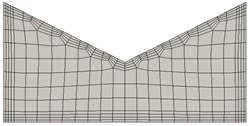
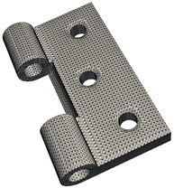
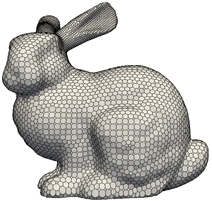

@page cfmesh_ref cfMesh

[TOC]

\section desc Description

<em>cfMesh</em> is an open-source meshing engine implemented on top of <em>OpenFOAM</em>. <em>Promesh</em> comes with a fully integrated <em>cfMesh</em>-based meshing module. <em>cfMesh</em> can be used to refine specific objects within the mesh in multiple ways: through patches (user-defined groups of surface triangles), through objects (simple geometric shapes that contain the volume to be refined), or by applying refinement to all surfaces or edges in the mesh. <em>cfMesh</em> can also generate boundary layers, which are extruded from the surface toward the interior of the mesh.

To enable the capability, the <em>Promesh</em> should be compiled with `ENABLE_CFMSH=ON`.

\note <em>cfMesh</em> depends on <em>OpenFOAM</em>, so before starting the compile process make sure to load 
<em>OpenFOAM</em> environment variables. Depending on the version, <em>OpenFOAM</em> can be loaded by sourcing the 
bashrc, or cshrc scripts provided in the OpenFoam-x.y/etc/. On a default installation, this can be done by executing 
the following command in the working terminal:

    . /usr/lib/openfoam/openfoam2006/etc/bashrc

Refer to the <em>OpenFOAM</em> documentation for further  instructions. After the <em>OpenFOAM</em> environment is 
loaded, enable <em>cfMesh</em> build by adding this line to the cmake command:

    -DENABLE_CFMSH=ON

\section ex Examples

Generic code for <em>cfMesh</em>:
```json
{
    "Program Type": "Mesh Generation",
    "Mesh File Options": {
        "Input Geometry File": "geometry.stl"
        "Output Mesh File": "meshed_geometry.vtu"
    },
    "Mesh Generation Options": {
        "Mesh Generation Engine": "cfmesh",
        "CFMesh Parameters": {
            "Generator": "<GENERATOR>"
            }
        }
    }
}
```
Where `"<GENERATOR>"` can be replaced with one of the four generators provided by <em>cfMesh</em>:
- `"cartesian2D"`
- `"cartesian3D"`
- `"tetMesh"`
- `"polyMesh"`

\subsubsection cart2d Cartesian 2D
The `"cartesian2D"` generator generates 2D meshes that are primarily made up of quadrilaterals, with some polygons around boundaries.

 

\subsubsection cart3d Cartesian 3D
The `"cartesian3D"` generator generates 3D meshes that are primarily made up of hexahedral elements, with some polyhedral elements around boundaries.

\subsubsection tetmesh TetMesh
The `"tetMesh"` generator generates 3D meshes consisting of tetrahedral cells. It does not generate boundary layers by default, so they must be specified and refined by user request.

 


\subsubsection polymesh PolyMesh
The `"polyMesh"` generator generates meshes consisting of arbitrary polyhedral cells.

 

\section params Parameters

\subsection general_params General

Only three things are strictly required to run the <em>cfMesh</em> engine: an input file, an output file name, and a `"MaxCellSize"`. However, if a uniform cell size is not satisfactory, other keywords can be used to specify local refinement options.


- <strong>`MaxCellSize`</strong>:  Maximum cell size generated in the domain.  Required 
- <strong>`MinCellSize`</strong>:  If specified, activates automatic refinement and sets a minimum cell size. Optional 


\subsection boundary_layers Boundary Layers

Boundary layers in <em>cfMesh</em> are extruded from the boundary faces of the mesh toward the interior. Their thickness is controlled by the cell size specified at the boundary and the mesher tends to produce layers of similar thickness to the cell size. 


- <strong>`BoundaryCellSize`</strong>:  Global size for boundary cells. 
- <strong>`BoundaryCellSizeRefinementThickness`</strong>:  Specifies the distance from the boundary at which the specified boundary cell size is still applied  
- <strong>`BoundaryLayers`</strong>:   
    - <strong>`NLayers`</strong>:  The number of layers which will be generated in the mesh.  Optional; if not provided, default is either 1 or 0, depending on if boundary layers are to be used or not.
    - <strong>`ThicknessRatio`</strong>: The ratio between the thickness of two successive layers.  Optional; if provided, must be larger than 1. Default is 1. 
    - <strong>`MaxFirstLayerThickness`</strong>: The maximum thickness of the first boundary layer.  Optional.  
    - <strong>`AllowDiscontinuity`</strong>: Ensures that the number of layers required for a patch will not spread to other patches in the same layer.  
    - <strong>`PatchBoundaryLayers`</strong>: Local settings for individual patches.   
        - <strong>`PatchName`</strong>:   
            - <strong>`NLayers`</strong>:  The number of layers which will be generated in the mesh.  Optional; if not provided, default is either 1 or 0.
            - <strong>`ThicknessRatio`</strong>: The ratio between the thickness of two successive layers.  Optional; if provided, must be larger than 1. Default is 1. 
            - <strong>`MaxFirstLayerThickness`</strong>: The maximum thickness of the first boundary layer.  Optional.  
            - <strong>`AllowDiscontinuity`</strong>: Ensures that the number of layers required for a patch will not spread to other patches in the same layer.   
- <strong>`AllowDisconnectedDomains`</strong>:  Allows for multi-region meshing, if set to `true`. 
- <strong>`KeepCellsIntersectingBoundary`</strong>:  If this is `true`, cells intersected by the boundary remain part of the template.  Default is `false` 
- <strong>`CheckForGluedMesh`</strong>:  If this and "KeepCellsIntersectingBoundary" are `true`, remove cells where distinct parts of the mesh are joined together.  

\subsection surface_feature Surface Feature Edges

`SurfaceFeatureEdges` is a utility that generates feature edges by extracting them from the given geometry file and saving them in a new file as a geometry input. All edges with angles larger than the angle provided will be included in the new file.


- <strong>`SurfaceFeatureEdges`</strong>:   
    - <strong>`Angle`</strong>:  Minimum intersection angle for edges to be extracted and included in the new geometry input file.  

\subsection obj_ref Object Refinements

Object refinement is used to specify refinement zones inside the volume. These zones can be boxes, cones, hollow cones, spheres, or lines, and each of those shapes has its own associated parameters to be specified. The level of refinement can be specified in two ways: either by specifying both `"AdditionalRefinementLevels"` and `"RefinementThickness"` or by specifying `"CellSize"`.


- <strong>`ObjectRefinements`</strong>:   
    - <strong>`Name`</strong>:  Name of the object.  
    - <strong>`Params`</strong>:   These must be implemented as specified in the <em>cfMesh</em> manual. 
        - <strong>`type`</strong>:  Specification of the primitive geometry for the refinement object.  Can be `"box"`, `"cone"`, `"hollowcone"`, `"sphere"`, or `"line"`.
        - <strong>`refinementThickness`</strong>:  The thickness of the refinement zone away from the specified object.  Entered as a string, eg `"10"`. 
        - <strong>`additionalRefinementLevels`</strong>:  The number of additional refinement levels to be applied within the volume, compared to `"MaxCellSize"`.  Entered as a string, eg `"2"`. 
        - <strong>`cellSize`</strong>:  Cell size within the refinement object.  can be given as a value, such as `7.51`. 
        - <strong>`centre`</strong>:  Center of the box or sphere objects. <strong>Note spelling.</strong> Must be present for `"box"` and `"sphere"` types. Entered as string, eg `"(0 0 0)"`. 
        - <strong>`lengthX`</strong>:  Side length in the <em>x</em> direction for the box object.  Must be present for `"box"` type. Entered as string, eg `"100"`.
        - <strong>`lengthY`</strong>:  Side length in the <em>y</em> direction for the box object.  Must be present for `"box"` type. Entered as string, eg `"100"`.
        - <strong>`lengthZ`</strong>:  Side length in the <em>z</em> direction for the box object.  Must be present for `"box"` type. Entered as string, eg `"100"`.
        - <strong>`p0`</strong>:  The point at which the radius is `"radius0"` for the cone object.  Must be present for `"cone"`, `"hollowcone"`, and `"line"` types. Entered as string, eg `"(-10 0 10)"`. 
        - <strong>`p1`</strong>:  The point at which the radius is `"radius1"` for the cone object.  Must be present for `"cone"`, `"hollowcone"`, and `"line"` types. Entered as string, eg `"(-10 0 10)"`. 
        - <strong>`radius`</strong>:  The radius of the sphere object.  Must be present for `"sphere"`. Entered as string, eg `"7"`. 
        - <strong>`radius0`</strong>:  The radius at `"p0"` for the cone object.  Must be present for `"cone"`. Entered as string, eg `"6"`. 
        - <strong>`radius1`</strong>:  The radius at `"p1"` for the cone object.  Must be present for `"cone"`. Entered as string, eg `"5"`. 
        - <strong>`radius0_Inner`</strong>:  The inner radius at `"p0"` for the hollow cone object.  Must be present for `"hollowcone"`. Entered as string, eg `"4"`. 
        - <strong>`radius0_Outer`</strong>:  The outer radius at `"p0"` for the hollow cone object.  Must be present for `"hollowcone"`. Entered as string, eg `"5"`. 
        - <strong>`radius1_Inner`</strong>:  The inner radius at `"p1"` for the hollow cone object.  Must be present for `"hollowcone"`. Entered as string, eg `"2"`. 
        - <strong>`radius1_Outer`</strong>:  The outer radius at `"p1"` for the hollow cone object.  Must be present for `"hollowcone"`. Entered as string, eg `"3"`. 
        
\subsection improve_mesh_qual Improve Mesh Quality

Mesh quality is improved via smoothing.

- <strong>`ImproveMeshQuality`</strong>:     
    - <strong>`NIterations`</strong>:  Number of optimization iterations.  Default is 50 
    - <strong>`NLoops`</strong>:  Number of inner loops in optimization.  Default is 10 
    - <strong>`QualityThreshold`</strong>:  Minimum mesh quality before optimization is considered done.  Default is 0.1 
    - <strong>`NSurfaceIterations`</strong>:  Number of surface iterations.  Default is 2 
    - <strong>`ConstrainedCellsSet`</strong>:  Name of constrained cell set.  


\subsection local_ref Local Refinement

The local refinement section allows for regions of refinement at the boundary. This can be done in two ways: either by specifying both `"AdditionalRefinementLevels"` and `"RefinementThickness"` or by specifying `"CellSize"`.


- <strong>`LocalRefinement`</strong>:   Optional 
    - <strong>`PatchName`</strong>:  Patch name from the surface mesh.  Accepts regex 
    - <strong>`AdditionalRefinementLevels`</strong>:  Additional refinement levels to the specified `MaxCellSize`.  
    - <strong>`RefinementThickness`</strong>:  Thickness of the refinement zone away from the patch.  
    - <strong>`CellSize`</strong>:  Desired cell size for local refinement. Entered as value, eg 2.5


\subsection rename_bound Rename Boundary

It may be desired to change the names and types of patches during the meshing process.


- <strong>`RenameBoundary`</strong>:   Optional 
    - <strong>`DefaultName`</strong>:  The default name that will be assigned to all patches other than those specified within the "NewPatchNames" block.  Optional 
    - <strong>`DefaultType`</strong>:  The default type that will be assigned to all patches other than those specified within the "NewPatchNames" block.  Optional 
    - <strong>`NewPatchNames`</strong>:   
        - <strong>`Name` </strong>  Patch name from the surface mesh.  Accepts regex 
        - <strong>`NewName`</strong>:  Patch name in the volume mesh.  Optional 
        - <strong>`NewType`</strong>:  Patch type in the volume mesh.  Optional 
        