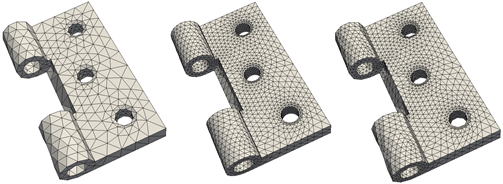

@page netgen_ref Netgen

\section desc Description

<em>Netgen</em> is an automatic mesh generation engine. It can read in a provided .stl geometry, generate a mesh, then refine it using h-refinement. The figure below shows three meshes made from a hinge model. The leftmost mesh uses the default values, the center mesh refines without geometry adaptation, and the rightmost mesh refines with geometry adaptation.



A generic input file for mesh generation with <em>Netgen</em> is shown below, with the default values for each parameter provided. Note that
all parameters listed under `"Netgen Parameters"` are optional.
```json
{
  "Program Type": "Mesh Generation",
  "Mesh File Options": {
    "Input Geometry File": "geometry.stl",
    "Output Mesh File": "meshed_geometry.vtu"
  },
  "Mesh Generation Options": {
    "Mesh Generation Engine": "netgen",
    "Netgen Parameters": {
      "uselocalh": true,
      "maxh": 1000.0,
      "fineness": 0.5,
      "grading": 0.3,
      "elementsperedge": 2.0,
      "elementspercurve": 2.0,
      "closeedgeenable": false,
      "closeedgefact": 2.0,
      "second_order": false,
      "meshsize_filename": "mesh_size_file",
      "quad_dominated": false,
      "optvolmeshenable": true,
      "optsteps_2d": 3,
      "optsteps_3d": 3,
      "invert_tets": false,
      "invert_trigs": false,
      "check_overlap": true,
      "check_overlapping_boundary": true,
      "refine_with_geometry_adaptation": false,
      "refine_without_geometry_adaptation": false
    }
  }
}
```

\section params Netgen Parameters

- <strong>`uselocalh`</strong>:  If `true`, enables local mesh size modifiers.  Default is `true`
- <strong>`maxh`</strong>:  Sets the maximum global mesh size.  Default is 1000.0
- <strong>`fineness`</strong>:  Sets the density of the mesh.  Must be between 0 (coarse) and 1 (fine). Default is 0.5 
- <strong>`grading`</strong>:  Sets the grading of the mesh.  Must be between 0 (uniform) and 1 (aggressive local grading). Default is 0.3 
- <strong>`elementsperedge`</strong>:  Sets the number of elements per edge.  Default is 2.0 
- <strong>`elementspercurve`</strong>:  Sets the number of elements per curvature radius of the geometry.  Default is 2.0 
- <strong>`closeedgeenable`</strong>:  If `true`, enables mesh refinement at close edges.  Default is `false` 
- <strong>`closeedgefact`</strong>:  If `"closeedgeenable"` is set to `true`, this sets the extent of that refinement.  Larger numbers indicate a finer mesh; default is 2.0 
- <strong>`second_order`</strong>:  If enabled, <em>Netgen</em> will use second-order surface and volume elements.  Default is `false` 
- <strong>`meshsize_filename`</strong>:  Specifies the name of an external mesh size file.  Optional 
- <strong>`quad_dominated`</strong>:  If enabled, <em>Netgen</em> will generate a quad-dominant mesh.  Default is `false`
- <strong>`optvolmeshenable`</strong>:  Can be enabled to allow for automatic optimization of volume meshes.  Default is `true` 
- <strong>`optsteps_2d`</strong>:  Sets the number of optimization steps to be used for 2D meshes.  Default is 3 
- <strong>`optsteps_3d`</strong>:  Sets the number of optimization steps to be used for 3D meshes.  Default is 3 
- <strong>`invert_tets`</strong>:  If enabled, inverts tetrahedral elements in the mesh.  Default is `false`, which corresponds to outward-facing normals.
- <strong>`invert_trigs`</strong>:  If enabled, inverts triangular elements in the mesh.  Default is `false`, which corresponds to outward-facing normals.
- <strong>`check_overlap`</strong>:  If enabled, checks for overlapping surfaces during surface meshing.  Default is `true` 
- <strong>`check_overlapping_boundary`</strong>:  If enabled, checks for overlapping surfaces before volume meshing.  Default is `true` 
- <strong>`refine_with_geometry_adaptation`</strong>:  If enabled, attempts to adapt refinement based on the geometry.  Default is `false` 
- <strong>`refine_without_geometry_adaptation`</strong>:  If enabled, refines without adapting based on the geometry.  Default is `false` 
